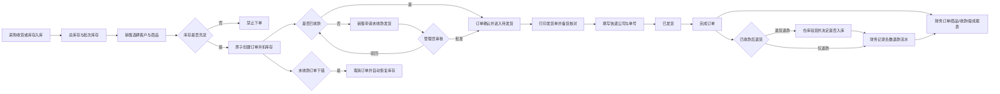

# 紫都后台上线前主流程测试报告

测试日期：2026-07-15
范围：网页库存 → 销售下单 → 收款 → 待发货 → 发货 → 完成 → 财务；同时核对取消与退货退款分支。

## 1. 主流程图

## 2. 本次实际检查结果

| 检查项 | 结果 | 说明 |
|---|---|---|
| 网页构建与代码规范 | 通过 | `npm run build`、`npm run lint` 均通过 |
| 云端产品与规格读取 | 通过 | 239 个产品；199 个原料、46 个成品 |
| 云端订单读取 | 通过 | 26 张订单 |
| 金额与收款一致性 | 通过 | 未发现订单小计、商品行、已收金额与收款流水不一致 |
| 库存合法性 | 通过 | 未发现负库存；批次余量未超过系统总库存 |
| 采购收货与批次 | 通过 | 当前 1 条采购明细与有效批次累计一致 |
| 页面加载 | 通过 | 库存、订单、发货、财务均能读取真实云端数据 |
| 原料购物车与结算 | 通过 | 可加购、进入结算、显示客户/折扣/运费、可删除商品 |
| 桌面与移动布局 | 通过 | 1440px 和 390px 未出现整页横向溢出；财务表格保留内部横向浏览 |
| 页面运行错误 | 通过 | 演练中没有 JavaScript 控制台错误 |

本次没有在正式数据库提交新的测试订单、收款或发货，避免污染财务与审计数据。完整写入链路已提供 `supabase/test_core_flow_rollback.sql`，可在事务内测试并自动回滚。

## 3. 问题节点

### P0：成品库存未录入

- 46 个成品中，可售库存大于 0 的产品为 0。
- 网页默认进入成品目录，因此所有成品均显示缺货，销售不能从成品开始下单。
- 原料有 11 个产品可售，共 44 个可售规格，原料结算流程可以走通。

处理：上线前按实际瓶/个数量录入成品库存，不要恢复测试用的 999。

### P0：当前登录与云端权限不满足公网安全要求

- 未登录的 Supabase `anon` key 可以直接读取产品、订单等业务数据。
- 网页角色保存在本地存储，单纯修改本地身份即可显示管理员界面。
- 现状能运行，但界面登录不是数据库安全边界。

处理：单独实施 Supabase Auth、用户身份绑定、按角色 RLS 和安全函数鉴权。必须分阶段迁移，不能直接把现有 Allow all 策略改掉，否则网页和小程序会立即停摆。

### P0：2 张历史订单状态与当前规则不一致

- `ZDM-260421-CUS006-N000010`：2026-04-21 的旧 B2B 订单，金额 ¥1,960；未收款、未获特批，但状态为已发货，且没有物流记录。
- `ZDM-260421-CUS002-N000011`：2026-04-21 的旧 B2B 订单，金额 ¥15,800；未收款、未获特批，但状态为已完成。
- 当前网页、小程序与 v31 触发器已经阻止再次产生同类数据，判断为规则上线前的历史单。

处理：管理员核对这 2 张订单的真实收款与交付情况，再选择补录收款/物流、补录未收款审批，或按实际业务纠正状态。不要直接删除审计记录。

### P1：大部分现有库存没有批次追溯

- 当前只有 2 个库存批次，但有 239 个产品和 44 个可售规格。
- FIFO 会先把历史无批次库存作为“历史/无批次库存”出库，再消耗正式批次。
- 数量计算可以正确，但大部分旧库存不能追到供应商、入库日期和 GC-MS 编号。

处理：旧库存盘点后建立期初批次；今后采购统一从采购单收货生成批次。

### P1：状态接口需要数据库层加固

- 当前界面按钮限制正确，但旧通用状态函数仍允许部分跳级调用。
- 已新增 `supabase/migration_v38_order_status_guard.sql`：限制状态顺序、禁止客户端直接改状态，并要求发货时物流资料完整。

处理：在 Supabase 运行 v38 后，再运行 `verify_launch_integrity.sql`。

### P2：首屏脚本体积较大

- 构建产物主脚本约 1.22 MB，gzip 后约 330 KB，构建工具给出拆包提示。
- 不影响业务正确性，但移动网络首次加载仍可继续优化。

## 4. 上线顺序

1. 运行 `migration_v38_order_status_guard.sql`。
2. 运行 `verify_launch_integrity.sql`，所有 ready 为 true，中间异常明细应为 0 行。
3. 核对并处理 2 张历史异常订单。
4. 录入真实成品库存，并为旧库存建立期初批次。
5. 运行 `test_core_flow_rollback.sql`，8 个步骤应全部为 true，脚本最后回滚。
6. 再进行一张内部真实小额订单验收：销售下单、收款、打印发货单、发货、完成、财务导出。
7. 公网正式开放前完成 Auth + RLS 权限改造。

## 5. 当前结论

业务代码主链路已经连通，原料购物车、订单、发货和财务页面可正常使用，取消与售后函数也采用事务保护。当前不建议直接宣布“正式上线无问题”，阻塞项是成品库存为 0、2 张历史异常订单，以及匿名云端权限；完成上述 P0 后再做最终真实订单验收。
